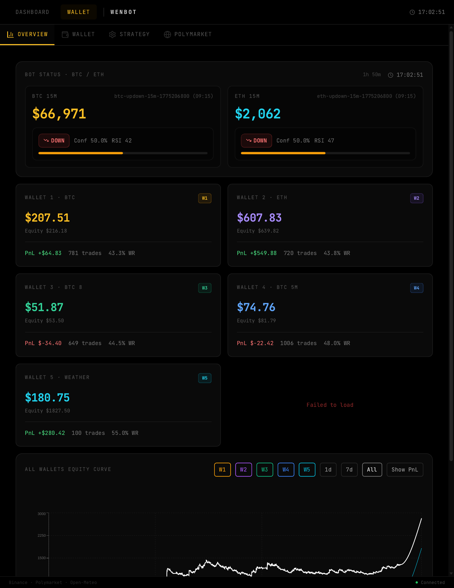

# Wenbot

A simulation-first Polymarket trading system for short-duration crypto prediction markets and weather temperature contracts.

Wenbot combines a Rust backend, a React dashboard, and a SQLite ledger to run multiple strategy wallets against Polymarket-style YES/NO markets. The system is designed for fast iteration: you can test signal generation, sizing, settlement, and portfolio behavior with virtual capital before touching a live wallet.

> **Status**: active personal project / research-grade trading simulator  
> **Primary markets**: BTC/ETH 15-minute up/down markets, BTC 5-minute variants, and weather temperature markets

## Screenshot



> Replace or update `docs/dashboard.png` if you want a more recent dashboard screenshot.

## What Wenbot Does

- Runs **multi-strategy virtual wallets** with separate balances and trade histories
- Trades **BTC and ETH 15-minute binary markets** using technical/microstructure signals
- Trades **weather temperature markets** using forecast-vs-market edge
- Tracks **open positions, realized P&L, equity curves, win rate, and trade ledgers**
- Provides a **web dashboard** for monitoring strategies and wallets in real time
- Supports an **optional live Polymarket wallet connection** alongside the simulator UI

## Current Wallet Layout

The original project concept centered on 3 wallets (BTC, ETH, Weather). The current implementation in the repo exposes **5 virtual wallets**:

| Wallet | Strategy | Default Starting Balance |
|---|---|---:|
| W1 | BTC 15m fivesbot | $100 |
| W2 | ETH 15m fivesbot | $100 |
| W3 | BTC 15m 8-indicator variant | $100 |
| W4 | BTC 5m variant | $100 |
| W5 | Weather temperature markets | $100 |

If you want to present Wenbot more narrowly, W1/W2/W5 are the core production-like simulation wallets.

## Core Features

### Strategy execution
- **BTC / ETH 15m binary options**
  - RSI
  - Momentum
  - VWAP
  - SMA
  - Market skew
  - Kelly-based sizing
- **BTC experimental variants**
  - 8-indicator BTC wallet
  - 5-minute BTC wallet
- **Weather markets**
  - Open-Meteo ensemble forecasts
  - NWS / actual temperature settlement checks
  - Edge-based YES/NO selection
  - Exposure caps and daily loss controls

### Portfolio & risk controls
- Virtual balance, equity, unrealized P&L, and trade history
- Daily loss limits
- Max trade size caps
- Duplicate-position prevention
- Open exposure caps for weather strategies
- Settlement and mark-to-market price refresh loops

### Monitoring & UI
- Real-time dashboard for BTC/ETH/weather status
- Wallet-specific positions and history views
- Equity curve visualization across wallets
- Signal panels with confidence and indicator details
- Manual actions for sync / settle / deposit during development

## Architecture

```text
┌───────────────────────────────────────────────────────────────────┐
│                           Frontend (React)                        │
│   Dashboard / Wallets / Strategy tabs / Live status / Charts      │
└───────────────────────────────┬───────────────────────────────────┘
                                │ HTTP / JSON
                                ▼
┌───────────────────────────────────────────────────────────────────┐
│                     API Server (Rust + Axum)                      │
│  - REST endpoints                                                  │
│  - background schedulers                                            │
│  - live state cache                                                 │
│  - optional Polymarket wallet session handling                      │
└───────────────┬──────────────────────────────┬────────────────────┘
                │                              │
                ▼                              ▼
┌───────────────────────────────┐   ┌───────────────────────────────┐
│       Strategy Crates          │   │        Virtual Wallet         │
│ - fivesbot-strategy            │   │ - positions                   │
│ - wenbot-strategy              │   │ - history                     │
│ - polymarket-client            │   │ - P&L / settlement            │
└───────────────┬───────────────┘   │ - SQLite storage              │
                │                   └───────────────────────────────┘
                ▼
┌───────────────────────────────────────────────────────────────────┐
│                        External Data Sources                       │
│ Binance · CryptoCompare · Polymarket Gamma/CLOB · Open-Meteo      │
└───────────────────────────────────────────────────────────────────┘
```

## Repository Structure

```text
wenbot/
├── frontend/                 # React + Vite dashboard
├── rust-backend/
│   ├── api-server/           # Axum API server + schedulers + websocket/live state
│   ├── fivesbot-strategy/    # BTC/ETH signal generation
│   ├── wenbot-strategy/      # Weather strategy
│   ├── virtual-wallet/       # Simulation wallet + ledger + settlement
│   ├── polymarket-client/    # Polymarket market/client helpers
│   └── backtest/             # Backtesting crate
├── docs/                     # Screenshots / docs assets
├── .env.example              # Example env config
└── README.md
```

## Rust Workspace Crates

| Crate | Purpose |
|---|---|
| `api-server` | HTTP API, schedulers, shared app state, route handlers |
| `fivesbot-strategy` | BTC/ETH strategy logic and indicator scoring |
| `wenbot-strategy` | Weather signal generation and forecast-based edge modeling |
| `virtual-wallet` | Position lifecycle, balances, settlement, trade ledgers, SQLite |
| `polymarket-client` | Market fetch / Polymarket interaction helpers |
| `backtest` | Backtesting support |

## Strategy Summary

### 1) BTC / ETH 15-minute markets
The `fivesbot` strategy trades Polymarket up/down markets on short windows. It builds a directional signal from market microstructure and recent candles, then sizes positions with Kelly-style logic under hard caps.

Key components visible in the codebase:
- RSI
- Momentum
- VWAP
- SMA
- Market skew
- Confidence scoring
- Position sizing with max trade size and daily loss control

### 2) BTC experimental variants
The current implementation includes:
- **W3:** BTC 15m 8-indicator variant
- **W4:** BTC 5m strategy variant

These are useful for comparing different feature sets and time horizons against the baseline wallet.

### 3) Weather temperature markets
The weather engine scans daily temperature markets and compares market prices against forecast-derived probabilities.

Inputs and behaviors include:
- Open-Meteo ensemble forecast data
- NWS / actual observed temperature for settlement
- Edge threshold filtering
- Kelly-style sizing
- Exposure cap management
- Duplicate trade protection
- Periodic settlement loop for expired contracts

## API Overview

Wenbot exposes a fairly rich local API. The most important routes are:

### Health & bot status
- `GET /api/health`
- `GET /api/bot/config`
- `GET /api/bot/status`

### BTC / ETH strategy status
- `GET /api/fivesbot/status`
- `GET /api/fivesbot/signals`
- `GET /api/fivesbot/trades`
- `GET /api/fivesbot/eth/status`
- `GET /api/fivesbot/eth/signals`
- `GET /api/fivesbot/eth/trades`

### Virtual wallets
- `GET /api/wallet/balance`
- `GET /api/wallet/positions`
- `GET /api/wallet/history`
- `POST /api/wallet/deposit?amount=...`
- `POST /api/wallet/sync-prices`
- `POST /api/wallet/settle`

Equivalent route groups exist for:
- `/api/wallet2/*` → ETH wallet
- `/api/wallet3/*` → BTC 8-indicator wallet
- `/api/wallet4/*` → BTC 5m wallet
- `/api/weather/*` → Weather wallet

### Live Polymarket wallet
The frontend also includes a Polymarket wallet section and connection flow for a live wallet session.

## Tech Stack

### Backend
- **Rust**
- **Axum**
- **Tokio**
- **SQLx**
- **SQLite**
- **Reqwest**

### Frontend
- **React 18**
- **Vite**
- **TypeScript**
- **Tailwind CSS**
- **Recharts**
- **TanStack Query**
- **Lucide React**

### Data sources
- **Polymarket Gamma API** for market discovery
- **Polymarket CLOB API** for token pricing / live-wallet integration
- **Binance** (`data-api.binance.vision`) for candles
- **CryptoCompare** as fallback market data
- **Open-Meteo** for weather forecasts

## Quick Start

### Prerequisites
- **Rust** toolchain (1.75+ recommended)
- **Node.js** 18+
- **npm**
- Optional: **PM2** for long-running backend process management

### 1) Clone the repository
```bash
git clone git@github.com:whosl/wenbot.git
cd wenbot
```

### 2) Configure environment
```bash
cp .env.example .env
cp frontend/.env.example frontend/.env.local
```

At minimum, check:
- backend database / runtime configuration
- any Polymarket credentials you intend to use
- `VITE_API_URL` for frontend deployment

> For pure local simulation work, you can keep live-wallet credentials unset.

### 3) Start the backend
```bash
cd rust-backend
cargo run -p api-server
```

By default the API server listens on:
- `http://localhost:8000`

### 4) Start the frontend
```bash
cd frontend
npm install
npm run dev
```

By default the frontend runs on:
- `http://localhost:3000`

Vite is configured to proxy `/api` requests to the Rust backend during local development.

## Build for Production

### Frontend
```bash
cd frontend
npm install
npm run build
```

### Backend
```bash
cd rust-backend
cargo build --release -p api-server
```

### PM2 example
The repo already includes a PM2 config:
```bash
cd rust-backend
pm2 start ecosystem.config.cjs
```

## Deployment Notes

- The Rust server serves as the core runtime and scheduler.
- Frontend and backend can be deployed together or separately.
- The local setup in this repo uses:
  - backend on port `8000`
  - frontend dev server on port `3000`
  - SQLite database file at `rust-backend/virtual_wallet.db`
- Proxy settings may matter for Polymarket / Binance access depending on your network environment.

## Development Notes

Useful local paths from the codebase:

- `rust-backend/api-server/src/scheduler.rs` — scheduler loops and execution flow
- `rust-backend/api-server/src/routes.rs` — main API routes
- `rust-backend/fivesbot-strategy/src/` — technical strategy implementation
- `rust-backend/wenbot-strategy/src/` — weather strategy implementation
- `frontend/src/App.tsx` — main dashboard shell
- `frontend/src/wallet/OverviewTab.tsx` — multi-wallet overview
- `frontend/src/wallet/WalletTab.tsx` — wallet-specific views

## Disclaimer

Wenbot is a trading research and simulation project. Even if a live-wallet path exists in the codebase, this repository should not be treated as financial advice, production-grade execution infrastructure, or a guarantee of profitability.

Use it carefully. Markets are very good at humbling overconfident bots.

## License

No license file is currently present in this repository.

If you plan to open-source Wenbot formally, add a `LICENSE` file and update this section accordingly.
